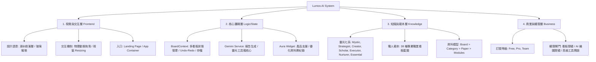

# Lumos AI: 系統架構與邏輯全圖 (System Architecture Tree)

這份文件旨在釐清 「Lumos AI」 的核心運作機制，作為後續開發與服務歸納的基礎指南。

---

## 🌳 1. 核心願景 (Vision)
> **「從混沌到照明 (From Chaos to Illumination)」**
Lumos (作業系統) 提供穩定的「棲地」，Aura (AI) 提供導航的「靈魂」。

---

## 🏗️ 2. 系統樹狀結構 (Architecture Tree)

---

## 🔍 3. 重要組件與設定說明

### A. 資料層級 (Data Hierarchy)
*   **User (使用者)**: 定義身份與 `SubscriptionTier`。
*   **Board (看板)**: 核心容器，關聯特定 `Persona` (職人角色)。
*   **Category (欄位/分類)**: 看板內的直列容器，支援 DnD 排序。
*   **Paper (紙條/卡片)**: 
    *   **類型**: 支援文字、圖片、連結、股市走勢、標記語言。
    *   **進階**: 可進化為 `Utility` 工具（計數器、番茄鐘等）。

### B. AI 支援體系 (Aura Ecosystem)
1.  **Aura Tools (靈光工具箱)**: 基於 Persona 切換的 3x7 組專屬 AI Prompt。
2.  **Aura Insight (導出報告)**: 
    *   **模式**: 會議記錄、投影片架構、待辦轉化、自我覆盤。
    *   **範圍**: 選定特定分類或全看板。
3.  **智能聊天生態系 (Dual-Chat System)**:
    *   **站內「產品支援中心」(Internal Support)**:
        *   **定位**: 產品專家。處理操作問答、功能優化建議（Feature Request）。
        *   **規範**: 採取嚴格資安檢查、繁體中文回答、結尾固定附加紀錄歸功語句。
    *   **首頁「Aura 靈光核心」(Landing Spirit)**:
        *   **定位**: 系統靈魂。強調成長、連結與心流（Flow）引導。
        *   **規範**: 內嵌管理員指令（`/admin`）、資安倫理防護優先、具備品牌哲學的靈性口吻。
4.  **Aura Buddy (隨身貼士)**: 位居螢幕右下角，提供基於 Persona 的動態提示與玄學貼士。

### C. 視覺語彙 (Visual Identity)
*   **Accent Color**: `Lake Green (#2DD4BF)` 漸層。
*   **Effect**: Glassmorphism (透明磨砂)、Framer Motion (物理擺動)。

---

## 📈 4. 未來擴展方向 (Roadmap Suggestions)

### 1. 服務歸納與自動化
*   **自動標籤系統**: 當 Paper 內容輸入時，AI 自動建議移動至適合的 Category。
*   **多端同步優化**: 目前依賴 `localStorage`，未來可對接 `Team` 模式的雲端資料庫。

### 2. 會員服務深化
*   **Pro 版獨佔主題**: 開放自定義看板背景（目前僅有 Lake Green 漸層）。
*   **API 插件化**: 容許第三方組件（Widgets）接入 Lumos 工具箱。

---

> **存檔位置**: `docs/ARCHITECTURE_TREE.md`
> **更新日期**: 2026-02-04 (v1.1 - 納入聊天機器人生態規範)
